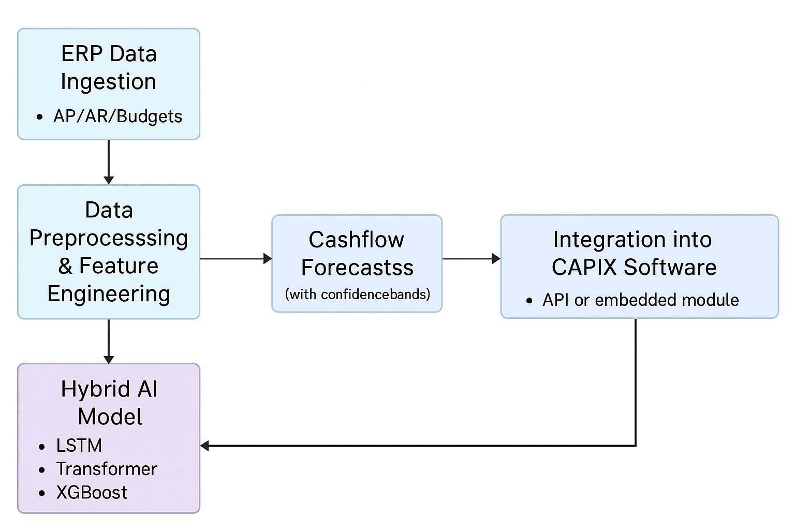

# Cashflow Management - Artificial Intelligence

## Empowering Treasury Teams with Smarter Forecasting

CAPIX introduces the next generation in corporate treasury management: **AI-enhanced cashflow forecasting**. Designed for multinational businesses with complex, multi-currency operations, our new forecasting module leverages cutting-edge artificial intelligence models to improve the accuracy, adaptability, and confidence of your treasury forecasts.

Traditionally, cashflow forecasting has relied on rule-based models and historical averages that often fall short in today's dynamic economic environment. With the rise of automation and machine learning, there's a better way to gain clarity into your future liquidity positions — and CAPIX is bringing it to your treasury.

---

## How It Works

Our AI solution integrates directly with your existing ERP systems, automatically ingesting and harmonizing financial data such as:

- Accounts Payable
- Accounts Receivable
- Budget and forecast inputs

The system then applies a **hybrid AI model** — combining deep learning and machine learning techniques — to identify complex patterns and make accurate multi-horizon predictions.

### The Architecture at a Glance:

1. **ERP Data Ingestion**  
   Automatically pulls structured data from your ERP, including payables, receivables, and budgetary allocations.

2. **Data Preprocessing & Feature Engineering**  
   Normalizes, transforms, and enhances data with features like seasonality, economic indicators, and exchange rates.

3. **Hybrid AI Model**  
   - **LSTM (Long Short-Term Memory)** for temporal forecasting  
   - **Transformer** models for sequence prediction across multiple variables  
   - **XGBoost** for structured, tabular data such as budget overrides and event-driven variables

4. **Cashflow Forecasts with Confidence Bands**  
   Delivers predictions with uncertainty quantification, giving treasury teams a range of expected outcomes, not just point estimates.

5. **Integration into CAPIX Software**  
   Forecasts are served through an embedded module or API, fully integrated with the rest of your treasury dashboard.

---

## Key Benefits

- 🔮 **More Accurate Forecasts**  
  Learn from historical trends, current inputs, and external signals to produce forecasts that evolve with your business.

- 🌐 **Multi-Currency & Global Ready**  
  Built with multinational operations in mind, the system supports FX impacts and cross-border visibility.

- 🔄 **Real-Time Updates**  
  Connects directly to data sources and refreshes predictions as new data becomes available.

- ✅ **Easy Integration**  
  Works seamlessly with CAPIX’s existing modules, with minimal effort from your IT team.

- 🔍 **Auditability & Explainability**  
  Forecast drivers and model logic are transparent, giving confidence to CFOs and auditors alike.

---

## Learn More

Want to see the AI forecast module in action? Contact CAPIX for a personalized demonstration or visit [www.capix.net](https://www.capix.net).

_CAPIX – empowering better decisions through intelligent treasury solutions._
