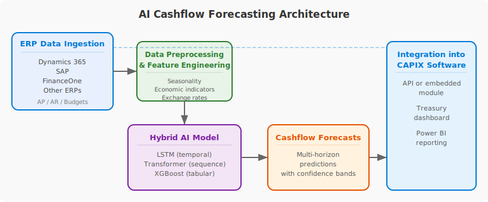

## Smart Cashflow Management
### Empowering Treasury Teams with Smarter Cash Management Forecasting using Artificial Intelligence
Over recent years, CAPIX has developed **specialist expertise in Artificial Intelligence** for cashflow forecasting and risk management. Our team has built deep capabilities across machine learning, deep learning and — most recently — AI agents that can manage cashflows independently.

CAPIX introduces the next generation in corporate treasury management: **AI-enhanced cashflow forecasting and autonomous treasury operations**. Designed for multinational businesses with complex, multi-currency operations, our forecasting and risk management modules leverage cutting-edge artificial intelligence models to improve the accuracy, adaptability, and confidence of your treasury operations.

Traditionally, cashflow forecasting has relied on rule-based models and historical averages that often fall short in today's dynamic economic environment. With the rise of automation, machine learning and agentic AI, there's a better way to gain clarity into your future liquidity positions — and CAPIX is bringing it to your treasury.

Read our latest article on [AI Agents for Autonomous Cashflow Management](/ai/agents/).

---

### How It Works
Our AI solution integrates directly with your existing ERP — including **Microsoft Dynamics 365**, **SAP** and **FinanceOne** — automatically ingesting and harmonizing financial data such as:

- Accounts Payable
- Accounts Receivable
- Budget and forecast inputs

The system then applies a **hybrid AI model** — combining deep learning and machine learning techniques — to identify complex patterns and make accurate multi-horizon predictions.

### The Architecture at a Glance:

1. **ERP Data Ingestion**  
   Automatically pulls structured data from your ERP, including payables, receivables, and budgetary allocations.

2. **Data Preprocessing & Feature Engineering**  
   Normalizes, transforms, and enhances data with features like seasonality, economic indicators, and exchange rates.

3. **Hybrid AI Model**  
   - **LSTM (Long Short-Term Memory)** for temporal forecasting  
   - **Transformer** models for sequence prediction across multiple variables  
   - **XGBoost** for structured, tabular data such as budget overrides and event-driven variables

4. **Cashflow Forecasts with Confidence Bands**  
   Delivers predictions with uncertainty quantification, giving treasury teams a range of expected outcomes, not just point estimates.

5. **Integration into CAPIX Software**  
   Forecasts are served through an embedded module or API, fully integrated with the rest of your treasury dashboard.

---

### Key Benefits
- 🔮 **More Accurate Forecasts**  
  Learn from historical trends, current inputs, and external signals to produce forecasts that evolve with your business.

- 🌐 **Multi-Currency & Global Ready**  
  Built with multinational operations in mind, the system supports FX impacts and cross-border visibility.

- 🔄 **Real-Time Updates**  
  Connects directly to data sources and refreshes predictions as new data becomes available.

- ✅ **Easy Integration**  
  Works seamlessly with CAPIX’s existing modules, with minimal effort from your IT team.

- 🔍 **Auditability & Explainability**  
  Forecast drivers and model logic are transparent, giving confidence to CFOs and auditors alike.

---

### AI Agents for Treasury
CAPIX is now applying **agentic AI** to treasury operations — AI agents that can monitor cashflows, identify risks and take management actions independently. Read our article on how this technology is transforming corporate treasury -> [AI Agents for Autonomous Cashflow Management](/ai/agents/)

---

### Learn More
Want to see the AI forecast module or autonomous agents in action? [Contact CAPIX](/contact/) for a personalised demonstration.

_CAPIX – empowering better decisions through intelligent treasury solutions._
